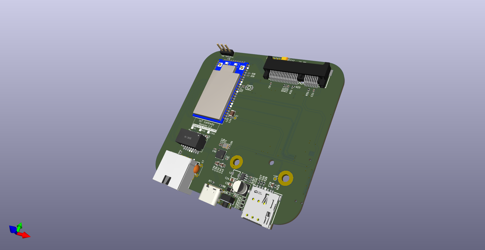

# Overview
This repository provides resources and instructions to build and configure an OpenWrt-based LoRaWAN gateway using an Hi-Link HLK7628 and an WM1302 LoRa concentrator board with 4G option. The project enables you to create a low-cost, fully functional LoRaWAN gateway for IoT applications.

